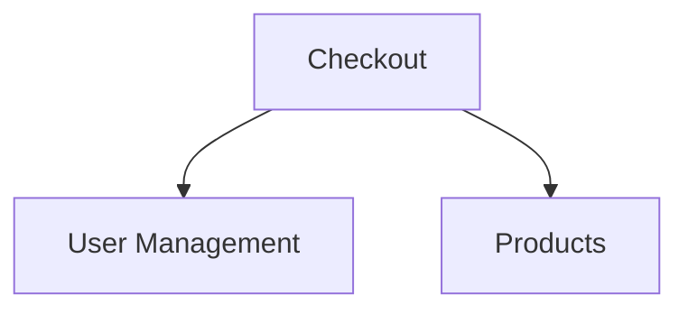

# Command /feature-list:design

Interactive feature design session for new or greenfield projects.

## Instructions

### Step 1: Understand Project Context

Use `AskUserQuestion` to gather initial context:

```yaml
questions:
  - question: "What type of application are you building?"
    header: "App Type"
    options:
      - label: "E-commerce"
        description: "Online store with products, cart, checkout"
      - label: "SaaS Platform"
        description: "Multi-tenant application with subscriptions"
      - label: "API Service"
        description: "Backend API for mobile/web clients"
      - label: "Internal Tool"
        description: "Admin panel or back-office system"
```

### Step 2: Identify User Roles

```yaml
questions:
  - question: "What user roles will your application have?"
    header: "User Roles"
    multiSelect: true
    options:
      - label: "Anonymous User"
        description: "Unauthenticated visitors"
      - label: "Registered User"
        description: "Authenticated regular users"
      - label: "Admin"
        description: "System administrators"
      - label: "Moderator"
        description: "Content or user moderators"
```

### Step 3: Define Core Entities

Based on project type, suggest core entities:

**E-commerce**:
- User, Product, Category, Cart, Order, Payment

**SaaS**:
- User, Organization, Team, Subscription, Feature

**API Service**:
- User, APIKey, RateLimit, Webhook

Ask user to confirm or modify:

```yaml
questions:
  - question: "Which core entities does your system need?"
    header: "Entities"
    multiSelect: true
    options:
      - label: "Users"
        description: "User accounts and profiles"
      - label: "Products"
        description: "Items for sale or display"
      - label: "Orders"
        description: "Purchase transactions"
      - label: "Organizations"
        description: "Multi-tenant companies/teams"
```

### Step 4: Define Key Workflows

```yaml
questions:
  - question: "What are the main workflows in your application?"
    header: "Workflows"
    multiSelect: true
    options:
      - label: "User Registration"
        description: "Sign up, email verification, onboarding"
      - label: "Purchase Flow"
        description: "Cart → Checkout → Payment → Confirmation"
      - label: "Content Publishing"
        description: "Draft → Review → Publish"
      - label: "Approval Process"
        description: "Submit → Review → Approve/Reject"
```

### Step 5: Identify Integrations

```yaml
questions:
  - question: "What external services will you integrate?"
    header: "Integrations"
    multiSelect: true
    options:
      - label: "Email (SendGrid/SES)"
        description: "Transactional emails"
      - label: "Payments (Stripe)"
        description: "Payment processing"
      - label: "Storage (S3)"
        description: "File uploads"
      - label: "OAuth (Google/GitHub)"
        description: "Social login"
```

### Step 6: Launch Feature Designer

Use `Task` tool to spawn `feature-designer` agent:

```
Design feature specifications for a {project_type} application with:

Roles: {roles}
Core Entities: {entities}
Workflows: {workflows}
Integrations: {integrations}

Generate:
1. Core features for each entity
2. Workflow features for each process
3. Integration features for external services
4. Suggest lifecycle and analytics features

Use BR/US/AC format with proper identifiers.
```

### Step 7: Review and Confirm

Present the designed features:

```markdown
## Designed Features

Based on your requirements, here's the proposed feature set:

### Core (4 features)
| ID | Feature | Business Rules | User Stories |
|----|---------|----------------|--------------|
| core-01 | User Management | 5 | 8 |
| core-02 | Product Catalog | 3 | 6 |
| core-03 | Shopping Cart | 2 | 4 |
| core-04 | Order Management | 4 | 5 |

### Workflow (2 features)
| ID | Feature | Business Rules | User Stories |
|----|---------|----------------|--------------|
| workflow-01 | Checkout Process | 6 | 3 |
| workflow-02 | Order Fulfillment | 3 | 4 |

Proceed with generating these feature files?
```

### Step 8: Generate Files

If confirmed:

1. Ensure directory exists (run init if needed)
2. Generate each feature file
3. Update README.md with index
4. Generate dependency graph

## Response Format

```markdown
## Feature Design Complete

### Project Summary

- **Type**: E-commerce
- **Roles**: Anonymous, User, Admin
- **Entities**: User, Product, Cart, Order

### Features Generated

| Phase | Count | Files |
|-------|-------|-------|
| Core | 4 | `core-01-user-management.md`, ... |
| Workflow | 2 | `workflow-01-checkout.md`, ... |
| Integration | 3 | `integration-01-email.md`, ... |

### Dependency Graph



### Next Steps

1. Review each feature file for accuracy
2. Add domain-specific business rules
3. Prioritize features for MVP
4. Start implementation with `/dev:develop`
```

## Templates by Project Type

### E-commerce Starter

```
Core: User, Product, Category, Cart, Order
Workflow: Checkout, Returns
Lifecycle: Order Status, Notifications
Integration: Email, Payments, Shipping
Analytics: Sales Reports
```

### SaaS Starter

```
Core: User, Organization, Team, Subscription
Workflow: Onboarding, Plan Upgrade
Lifecycle: Trial Expiry, Billing Reminders
Integration: Email, Payments, OAuth
Analytics: Usage Metrics, MRR
```

### API Service Starter

```
Core: User, APIKey, Application
Workflow: Key Rotation, Rate Limiting
Lifecycle: Key Expiry, Usage Alerts
Integration: Webhooks, Monitoring
Analytics: API Usage, Error Rates
```
