# Command /feature-list:graph

Regenerate the Mermaid dependency graph in the features README.

## Instructions

### Step 1: Find All Feature Files

Use `Glob` to find all feature files:

```
docs/technical-requirements/features/*.md
```

Exclude:
- `README.md`
- `00-template.md`

### Step 2: Parse Feature Frontmatter

For each feature file, read and parse YAML frontmatter:

```yaml
---
id: core-01
title: User Management
phase: core
status: completed
dependencies:
  - integration-01
---
```

Extract:
- `id` — Feature identifier
- `title` — Display name
- `phase` — Category for grouping
- `status` — For status icon
- `dependencies` — Links to other features

### Step 3: Validate Dependencies

Check each dependency exists:

```python
all_ids = {f.id for f in features}
for feature in features:
    for dep in feature.dependencies:
        if dep not in all_ids:
            warnings.append(f"{feature.id} → {dep} (not found)")
```

Check for circular dependencies:

```python
# Use DFS to detect cycles
def has_cycle(node, visited, rec_stack):
    visited.add(node)
    rec_stack.add(node)
    for dep in graph[node]:
        if dep in rec_stack:
            return True  # Cycle detected
        if dep not in visited and has_cycle(dep, visited, rec_stack):
            return True
    rec_stack.remove(node)
    return False
```

### Step 4: Generate Mermaid Graph

Build the Mermaid flowchart:

```mermaid
flowchart TD
    subgraph Core
        core-01[User Management ✅]
        core-02[Product Catalog 🔄]
    end

    subgraph Workflow
        workflow-01[Checkout 📝]
    end

    subgraph Integration
        integration-01[Email Service ✅]
    end

    workflow-01 --> core-01
    workflow-01 --> core-02
    workflow-01 --> integration-01
```



Status icons:
- `✅` — completed
- `🔄` — in_progress
- `📝` — draft

### Step 5: Update README

Read `docs/technical-requirements/features/README.md`

Find the markers:
```markdown
<!-- dependency-graph:start -->
...existing content...
<!-- dependency-graph:end -->
```

Replace content between markers with new graph.

Use `Edit` tool to make the replacement.

### Step 6: Report Results

```markdown
## Dependency Graph Updated

### Features Processed

| Phase | Count |
|-------|-------|
| Core | {n} |
| Workflow | {n} |
| Integration | {n} |
| Total | {total} |

### Dependencies

| From | To |
|------|----|
| workflow-01 | core-01 |
| workflow-01 | integration-01 |

### Warnings

⚠️ {warning_count} issues found:
- `workflow-02` depends on non-existent `core-99`
- Circular dependency: `core-01` → `core-02` → `core-01`

### Graph Preview

```mermaid
{generated_graph}
```
```

## Response Format

```markdown
## Dependency Graph Regenerated

✅ Updated `docs/technical-requirements/features/README.md`

### Statistics

- **Features**: {count}
- **Dependencies**: {dep_count}
- **Phases**: {phase_count} with features

### Validation

{if no warnings}
✅ All dependencies valid, no cycles detected.
{else}
⚠️ Issues found:
- {issue1}
- {issue2}
{endif}

### Updated Graph

```mermaid
flowchart TD
    subgraph Core
        core-01[User Management ✅]
    end
    ...
```


```

## Edge Cases

### No Feature Files

If no feature files found:
```markdown
⚠️ No feature files found in `docs/technical-requirements/features/`

Run `/feature-list:init` to initialize, or `/feature-list:add` to create features.
```

### Missing README

If README.md doesn't exist:
```markdown
⚠️ README.md not found.

Creating from template...
```

### No Markers in README

If dependency graph markers not found:
```markdown
⚠️ Dependency graph markers not found in README.md.

Adding markers and graph at the end of the file.
```

Insert:
```markdown
## Dependency Graph

<!-- dependency-graph:start -->
{graph}
<!-- dependency-graph:end -->
```

### Features Without Dependencies

Features with empty dependencies array are included in subgraphs but have no arrows pointing from them.
