# Dependency Graph Reference

Generate and maintain Mermaid diagrams showing feature dependencies.

## Graph Format

The dependency graph uses Mermaid flowchart syntax:


## Graph Generation Algorithm

### Step 1: Parse Feature Files

Read all feature files and extract:
- `id` from frontmatter
- `title` from frontmatter
- `dependencies` array from frontmatter

```python
features = []
for file in glob("docs/technical-requirements/features/*.md"):
    if file.name != "README.md" and file.name != "00-template.md":
        frontmatter = parse_yaml_frontmatter(file)
        features.append({
            "id": frontmatter["id"],
            "title": frontmatter["title"],
            "phase": frontmatter["phase"],
            "dependencies": frontmatter.get("dependencies", [])
        })
```

### Step 2: Group by Phase

```python
phases = {
    "core": [],
    "workflow": [],
    "lifecycle": [],
    "analytics": [],
    "integration": [],
    "ui": []
}

for feature in features:
    phases[feature["phase"]].append(feature)
```

### Step 3: Generate Mermaid

```python
mermaid = ["flowchart TD"]

# Add subgraphs for each phase
for phase, features in phases.items():
    if features:
        mermaid.append(f"    subgraph {phase.title()}")
        for f in features:
            mermaid.append(f'        {f["id"]}[{f["title"]}]')
        mermaid.append("    end")

# Add dependency arrows
for feature in all_features:
    for dep in feature["dependencies"]:
        mermaid.append(f'    {feature["id"]} --> {dep}')
```

## README Integration

The graph is embedded in README.md between markers:

```markdown
## Dependency Graph

<!-- dependency-graph:start -->

<!-- dependency-graph:end -->
```

### Regeneration

The `/feature-list:graph` command:
1. Parses all feature files
2. Generates new Mermaid code
3. Replaces content between markers
4. Preserves all other README content

## Validation

### Check for Non-Existent Dependencies

```python
all_ids = {f["id"] for f in features}

for feature in features:
    for dep in feature["dependencies"]:
        if dep not in all_ids:
            warn(f'{feature["id"]} depends on non-existent {dep}')
```

### Detect Circular Dependencies

```python
def has_cycle(graph, node, visited, rec_stack):
    visited.add(node)
    rec_stack.add(node)

    for neighbor in graph.get(node, []):
        if neighbor not in visited:
            if has_cycle(graph, neighbor, visited, rec_stack):
                return True
        elif neighbor in rec_stack:
            return True

    rec_stack.remove(node)
    return False
```

## Styling

### Phase Colors


### Status Indicators

```mermaid
flowchart TD
    core-01[User Management ✅]
    core-02[Products 🔄]
    workflow-01[Checkout 📝]
```



| Status | Icon |
|--------|------|
| completed | ✅ |
| in_progress | 🔄 |
| draft | 📝 |

## Example Output

Full example for an e-commerce project:

```mermaid
flowchart TD
    subgraph Core
        core-01[User Management ✅]
        core-02[Product Catalog ✅]
        core-03[Inventory 🔄]
    end

    subgraph Workflow
        workflow-01[Shopping Cart 🔄]
        workflow-02[Checkout 📝]
        workflow-03[Returns 📝]
    end

    subgraph Lifecycle
        lifecycle-01[Order Status 📝]
        lifecycle-02[Notifications 📝]
    end

    subgraph Integration
        integration-01[Email Service ✅]
        integration-02[Payment Gateway 🔄]
        integration-03[Shipping API 📝]
    end

    subgraph Analytics
        analytics-01[Sales Reports 📝]
    end

    workflow-01 --> core-01
    workflow-01 --> core-02
    workflow-02 --> workflow-01
    workflow-02 --> integration-02
    workflow-03 --> workflow-02
    lifecycle-01 --> workflow-02
    lifecycle-02 --> integration-01
    analytics-01 --> workflow-02
    integration-03 --> lifecycle-01
```


