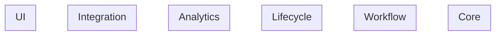

# Technical Requirements: Features

This document provides an overview of all features in the system.

## Quick Stats

| Phase | Total | Completed | In Progress | Draft |
|-------|-------|-----------|-------------|-------|
| Core | 0 | 0 | 0 | 0 |
| Workflow | 0 | 0 | 0 | 0 |
| Lifecycle | 0 | 0 | 0 | 0 |
| Analytics | 0 | 0 | 0 | 0 |
| Integration | 0 | 0 | 0 | 0 |
| UI | 0 | 0 | 0 | 0 |
| **Total** | **0** | **0** | **0** | **0** |

## Dependency Graph

<!-- dependency-graph:start -->

<!-- dependency-graph:end -->

## Feature Index

### Core Features

Fundamental entities and their basic operations.

| ID | Title | Status | Priority |
|----|-------|--------|----------|
| — | No features yet | — | — |

### Workflow Features

Business processes that involve multiple steps or entities.

| ID | Title | Status | Priority |
|----|-------|--------|----------|
| — | No features yet | — | — |

### Lifecycle Features

State transitions, notifications, and event-driven behaviors.

| ID | Title | Status | Priority |
|----|-------|--------|----------|
| — | No features yet | — | — |

### Analytics Features

Reporting, metrics, and data analysis.

| ID | Title | Status | Priority |
|----|-------|--------|----------|
| — | No features yet | — | — |

### Integration Features

External service connections and third-party APIs.

| ID | Title | Status | Priority |
|----|-------|--------|----------|
| — | No features yet | — | — |

### UI Features

User interface components and view-specific logic.

| ID | Title | Status | Priority |
|----|-------|--------|----------|
| — | No features yet | — | — |

## How to Use

### Adding a New Feature

```bash
/feature-list:add <phase> <feature-name>
```

Example:
```bash
/feature-list:add core user-management
```

### Updating the Graph

After modifying dependencies, regenerate the graph:

```bash
/feature-list:graph
```

### Checking Status

View implementation progress:

```bash
/feature-list:status
```

## Conventions

### File Naming

```
<phase>-<number>-<kebab-case-name>.md
```

Examples:
- `core-01-user-management.md`
- `workflow-02-checkout.md`
- `integration-01-email-service.md`

### Identifier Format

| Type | Format | Example |
|------|--------|---------|
| Business Rule | `BR-XXX-YYY` | `BR-USR-001` |
| User Story | `US-XXX-YYY` | `US-USR-001` |
| Acceptance Criteria | `AC-XXX-YYY` | `AC-USR-001` |

### Status Icons

| Icon | Status |
|------|--------|
| ✅ | Completed |
| 🔄 | In Progress |
| 📝 | Draft |

## Related Documents

- [Feature Template](./00-template.md) — Template for new features
