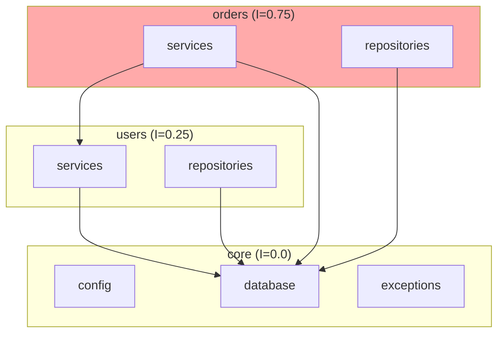

# Command /architect:deps

Analyze module dependencies at three levels: modules, packages, and layers.

## Instructions

### Step 1: Discover Modules

Find all modules in the project:

```
Glob: **/modules/*/__init__.py
Glob: **/apps/*/__init__.py
```

List module structure:
```bash
ls -la {{ path | default: "src/modules" }}
```

### Step 2: Analyze Module Dependencies

For each module, extract import statements:

```python
# Pattern to find cross-module imports
Grep: "from src.modules." in each module
Grep: "import src.modules." in each module
```

Build dependency matrix:

| Module | Depends On | Dependents |
|--------|------------|------------|
| users | core | orders, payments |
| orders | users, products | payments |
| payments | orders | - |

### Step 3: Detect Circular Dependencies

A circular dependency exists when:
- Module A imports Module B
- Module B imports Module A (directly or transitively)

**Detection algorithm:**
1. Build directed graph of module dependencies
2. Find strongly connected components (SCC)
3. SCC with >1 node = circular dependency

**Common circular patterns:**
```python
# Direct circular
# users/services.py
from src.modules.orders.services import OrderService

# orders/services.py
from src.modules.users.services import UserService  # Circular!

# Transitive circular
# A → B → C → A
```

### Step 4: Analyze Package Dependencies

Check external package dependencies:

```bash
# From pyproject.toml or requirements.txt
cat pyproject.toml | grep -A 100 "\[project.dependencies\]"
```

Categorize dependencies:
- **Core**: Python stdlib, typing
- **Framework**: FastAPI, Pydantic, SQLAlchemy
- **Infrastructure**: asyncpg, redis, celery
- **Development**: pytest, ruff, mypy

### Step 5: Analyze Layer Dependencies

Verify layer dependency rules:

```
Presentation → Application → Domain ← Infrastructure
```

**Violations to detect:**
- Router importing Repository directly (should go through Service)
- Service importing Router (reverse dependency)
- Model importing Service (domain shouldn't know about application)

```python
# Check for violations
Grep: "from.*repositories import" in **/routers.py  # Violation!
Grep: "from.*routers import" in **/services.py      # Violation!
Grep: "from.*services import" in **/models.py       # Violation!
```

### Step 6: Calculate Coupling Metrics

**Afferent Coupling (Ca):** Number of modules that depend on this module
**Efferent Coupling (Ce):** Number of modules this module depends on
**Instability (I):** Ce / (Ca + Ce) — 0 = stable, 1 = unstable

| Module | Ca | Ce | Instability | Assessment |
|--------|----|----|-------------|------------|
| core | 5 | 0 | 0.0 | Very stable (good for shared code) |
| users | 3 | 1 | 0.25 | Stable |
| orders | 1 | 3 | 0.75 | Unstable (depends on many) |
| utils | 4 | 2 | 0.33 | Moderately stable |

**Ideal:**
- Shared/core modules: Low instability (stable)
- Leaf/feature modules: High instability (can change freely)
- No module should depend on more unstable modules (Stable Dependencies Principle)

### Step 7: Generate Dependency Graph

Create visual representation:



## Response Format

```markdown
## Dependency Analysis: {{ path }}

### Summary

| Metric | Value | Status |
|--------|-------|--------|
| Total Modules | {{ count }} | - |
| Circular Dependencies | {{ circular_count }} | {{ status }} |
| Layer Violations | {{ violation_count }} | {{ status }} |
| Average Instability | {{ avg_instability }} | {{ status }} |

### Module Dependencies

```mermaid
{{ dependency_graph }}
```

### Circular Dependencies

{{ #if has_circular }}
⚠️ **Circular dependencies detected!**

| Cycle | Modules | Severity |
|-------|---------|----------|
| 1 | {{ cycle_1 }} | {{ severity }} |
| 2 | {{ cycle_2 }} | {{ severity }} |

**Resolution strategies:**

1. **Extract shared interface** — Create protocol/interface in shared module
2. **Dependency Inversion** — Depend on abstractions, not concretions
3. **Event-based communication** — Replace direct calls with events
4. **Merge modules** — If tightly coupled, maybe they should be one module

**Example fix for {{ cycle_1 }}:**
```python
# Before (circular)
# users/services.py
from orders.services import OrderService

# orders/services.py
from users.services import UserService

# After (using Protocol)
# shared/protocols.py
class UserServiceProtocol(Protocol):
    async def get_by_id(self, id: int) -> User | None: ...

# orders/services.py
class OrderService:
    def __init__(self, user_service: UserServiceProtocol): ...
```
{{ else }}
✅ No circular dependencies detected.
{{ /if }}

### Layer Violations

{{ #if has_violations }}
⚠️ **Layer dependency violations detected!**

| File | Violation | Fix |
|------|-----------|-----|
| {{ file }} | {{ violation }} | {{ fix }} |

{{ else }}
✅ Layer dependencies are correct.
{{ /if }}

### Coupling Metrics

| Module | Ca | Ce | Instability | Assessment |
|--------|----|----|-------------|------------|
{{ #each modules }}
| {{ name }} | {{ ca }} | {{ ce }} | {{ instability }} | {{ assessment }} |
{{ /each }}

### External Dependencies

#### Production
| Package | Version | Purpose |
|---------|---------|---------|
{{ #each prod_deps }}
| {{ name }} | {{ version }} | {{ purpose }} |
{{ /each }}

#### Development
| Package | Version | Purpose |
|---------|---------|---------|
{{ #each dev_deps }}
| {{ name }} | {{ version }} | {{ purpose }} |
{{ /each }}

### Recommendations

1. {{ recommendation_1 }}
2. {{ recommendation_2 }}
3. {{ recommendation_3 }}

### Related Commands

- `/architect:review` — Full architecture review
- `/architect:diagram component` — Visualize components
- `/architect:adr "Resolve circular dependencies"` — Document decision
```
