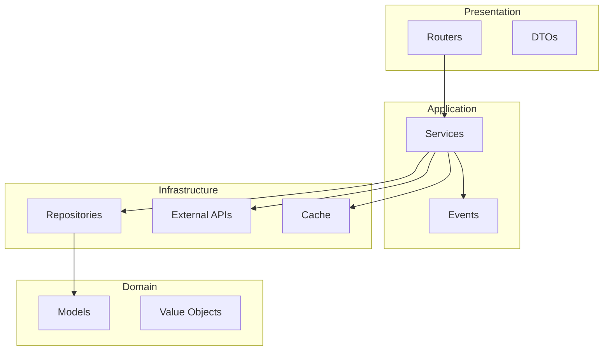
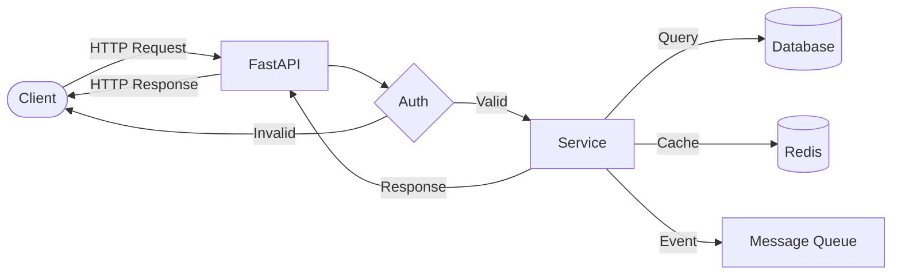
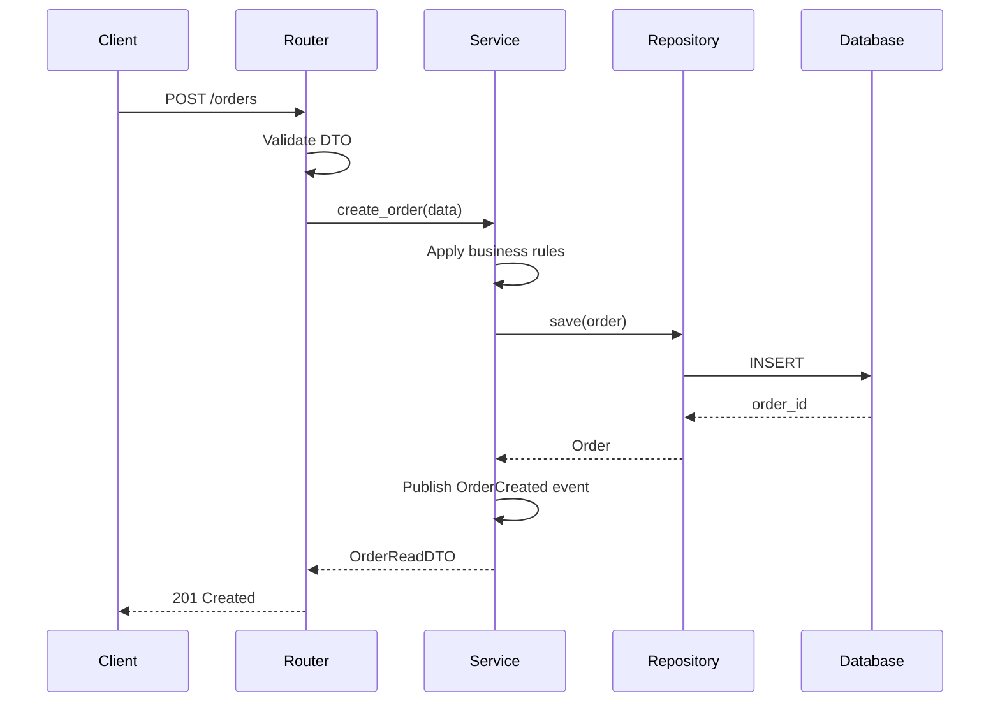
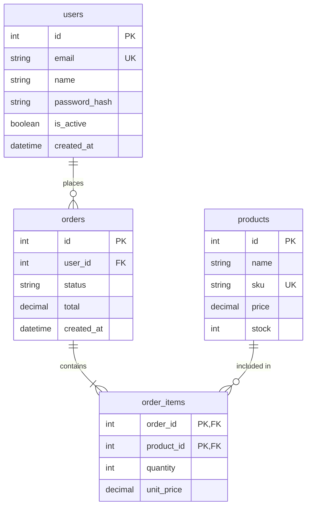
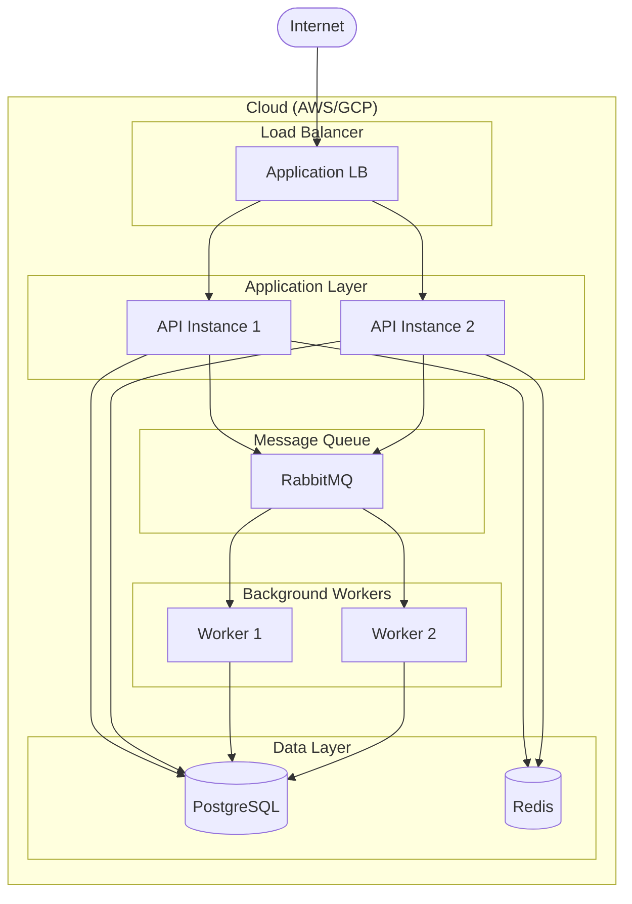

# Command /architect:diagram

Generate architecture diagrams in Mermaid format based on codebase analysis.

## Diagram Types

### 1. Component Diagram

Shows high-level system components and their relationships.



### 2. Data Flow Diagram

Shows how data flows through the system.



### 3. Sequence Diagram

Shows interaction between components for a specific use case.



### 4. ER Diagram

Shows database entity relationships.



### 5. Deployment Diagram

Shows infrastructure and deployment topology.



## Instructions

### Step 1: Analyze Codebase

Based on diagram type, gather relevant information:

**For Component Diagram:**
```
Glob: **/routers.py, **/services.py, **/repositories.py, **/models.py
```

**For ER Diagram:**
```
Read: **/models.py
Grep: "class.*Base" in **/models.py
Grep: "ForeignKey" in **/models.py
Grep: "relationship" in **/models.py
```

**For Sequence Diagram:**
- Identify the use case to diagram
- Trace the call flow through layers

**For Data Flow:**
- Identify entry points (routers)
- Trace data transformation through layers

**For Deployment:**
- Check for Docker/Kubernetes configs
- Identify external services

### Step 2: Extract Entities

**Models:**
```python
# From models.py, extract:
- Table names
- Primary keys
- Foreign keys
- Relationships (1:1, 1:N, N:M)
```

**Services:**
```python
# From services.py, extract:
- Service names
- Dependencies (injected)
- Methods (public API)
```

**Routers:**
```python
# From routers.py, extract:
- Route prefixes
- Endpoints
- Dependencies
```

### Step 3: Generate Diagram

Based on extracted information, generate appropriate Mermaid diagram.

## Response Format

```markdown
## {{ type | capitalize }} Diagram

### Overview

{{ brief_description }}

### Diagram

```mermaid
{{ mermaid_code }}
```

### Legend

| Symbol | Meaning |
|--------|---------|
| {{ symbol }} | {{ meaning }} |

### Components Analyzed

| Component | Location | Dependencies |
|-----------|----------|--------------|
| {{ name }} | {{ file }} | {{ deps }} |

### Notes

{{ additional_notes }}

### Export Options

To export this diagram:
1. **VS Code**: Install Mermaid extension
2. **Online**: Use [Mermaid Live Editor](https://mermaid.live)
3. **CLI**: `npx @mermaid-js/mermaid-cli -i diagram.md -o diagram.png`

### Related Diagrams

- `/architect:diagram component` — High-level components
- `/architect:diagram er` — Database schema
- `/architect:diagram sequence` — Request flow
```
