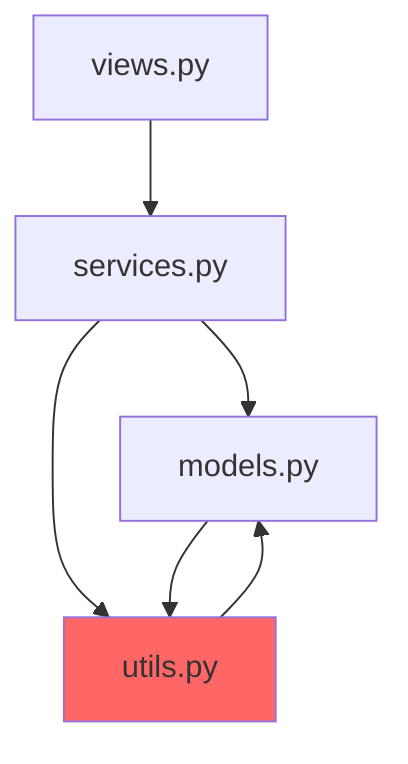

# Command /architect:modernize

Analyze legacy codebase and create a phased modernization plan using Strangler Fig pattern.

## Instructions

### Step 1: Discover Project Structure

```bash
# Find all Python files
find {{ path | default: "." }} -name "*.py" -type f | head -50

# Check for common patterns
ls -la {{ path | default: "." }}
```

Use `Glob` and `Grep` to understand the codebase:
- Find entry points (main.py, app.py, wsgi.py)
- Identify frameworks (Flask, Django, FastAPI)
- Locate models, views/routes, services

### Step 2: Analyze Current Architecture

**Check for architectural patterns:**

```python
# Look for layered architecture
Glob: **/models.py, **/views.py, **/services.py, **/repositories.py

# Look for module structure
Glob: **/modules/*/__init__.py, **/apps/*/__init__.py

# Find configuration
Glob: **/config.py, **/settings.py, **/.env.example
```

**Identify anti-patterns:**

| Anti-Pattern | Detection |
|--------------|-----------|
| God Objects | Classes > 500 lines, > 20 methods |
| Circular Dependencies | Imports inside functions |
| No Separation | Business logic in views/routes |
| Global State | Module-level mutable variables |

### Step 3: Map Dependencies

**Internal dependencies:**
```python
# Find imports between modules
Grep: "from src\." or "from app\."
```

**External dependencies:**
```bash
# Check requirements
cat requirements.txt 2>/dev/null || cat pyproject.toml 2>/dev/null
```

**Database dependencies:**
- Find all models and their relationships
- Identify shared tables between modules
- Check for raw SQL queries

### Step 4: Assess Test Coverage

```bash
# Check for existing tests
find {{ path | default: "." }} -name "test_*.py" -o -name "*_test.py" | wc -l

# Check pytest configuration
cat pytest.ini 2>/dev/null || cat pyproject.toml | grep -A 20 "\[tool.pytest"
```

### Step 5: Identify Critical Paths

Analyze which code paths are:
1. **High traffic** — frequently executed
2. **High risk** — complex, poorly tested
3. **High value** — core business logic

Create risk/value matrix:

| Component | Risk | Value | Test Coverage | Priority |
|-----------|------|-------|---------------|----------|
| `user_auth` | High | High | 10% | **Critical** |
| `order_process` | High | High | 25% | **Critical** |
| `reporting` | Low | Medium | 5% | Low |

### Step 6: Design Target Architecture

Propose modern architecture based on findings:

```
src/
├── core/                    # NEW: Shared infrastructure
│   ├── config.py           # pydantic-settings
│   ├── database.py         # Async SQLAlchemy 2.0
│   ├── exceptions.py
│   └── dependencies.py
│
├── modules/                 # NEW: Extracted modules
│   ├── users/
│   ├── orders/
│   └── payments/
│
├── legacy/                  # TEMPORARY: Legacy code wrapper
│   └── adapters/           # Anti-corruption layer
│
└── main.py                  # NEW: FastAPI app
```

### Step 7: Create Migration Plan

**Phase 1: Stabilization (Week 1-2)**
- Add integration tests for critical paths
- Extract configuration to environment variables
- Set up logging and monitoring

**Phase 2: Infrastructure (Week 3-4)**
- Create `src/core/` with modern setup
- Set up async database layer
- Create Anti-Corruption Layer for legacy

**Phase 3: Gradual Extraction (Ongoing)**
- Extract modules one by one
- Start with lowest-risk, highest-value module
- Use Strangler Fig pattern

**Strangler Fig Pattern:**
```
┌─────────────────────────────────────────┐
│               New Router                │
│  ┌─────────┐              ┌─────────┐  │
│  │ /users  │──────────────│ /orders │  │
│  │  (new)  │              │ (legacy)│  │
│  └────┬────┘              └────┬────┘  │
│       │                        │       │
│       ▼                        ▼       │
│  ┌─────────┐              ┌─────────┐  │
│  │   New   │              │ Legacy  │  │
│  │ Service │              │  Code   │  │
│  └─────────┘              └─────────┘  │
└─────────────────────────────────────────┘
```

### Step 8: Generate Artifacts

Create modernization documentation:

1. **docs/modernization/README.md** — Overview and timeline
2. **docs/modernization/current-state.md** — Analysis results
3. **docs/modernization/target-state.md** — Target architecture
4. **docs/adr/001-modernization-strategy.md** — ADR

## Response Format

```markdown
## Modernization Plan: {{ project_name }}

### Current State Analysis

**Project Type**: {{ framework }} application
**Lines of Code**: {{ loc }}
**Test Coverage**: {{ coverage }}%
**Architecture**: {{ current_arch }}

#### Identified Issues

| Issue | Severity | Location | Impact |
|-------|----------|----------|--------|
| God Object | Critical | `app/services.py` | Hard to test, modify |
| No layers | High | Throughout | Business logic in views |
| Global state | High | `app/db.py` | Thread safety issues |
| Circular deps | Medium | `models ↔ utils` | Import errors |

#### Dependency Map



### Risk Assessment

| Component | Risk | Value | Coverage | Priority |
|-----------|------|-------|----------|----------|
| {{ component1 }} | {{ risk1 }} | {{ value1 }} | {{ cov1 }}% | {{ priority1 }} |

### Target Architecture

```
{{ target_structure }}
```

### Migration Phases

#### Phase 1: Stabilization ({{ duration1 }})
- [ ] Add integration tests for critical paths
- [ ] Extract configuration to .env
- [ ] Set up structured logging
- [ ] Add health check endpoint

#### Phase 2: Infrastructure ({{ duration2 }})
- [ ] Create src/core/ with pydantic-settings
- [ ] Set up async SQLAlchemy 2.0
- [ ] Create Anti-Corruption Layer
- [ ] Add FastAPI alongside existing app

#### Phase 3: Module Extraction ({{ duration3 }})
- [ ] Extract {{ first_module }} (lowest risk)
- [ ] Migrate database models
- [ ] Switch traffic gradually
- [ ] Remove legacy code

### Comparison

| Aspect | Current | Target |
|--------|---------|--------|
| Framework | {{ current_framework }} | FastAPI |
| ORM | {{ current_orm }} | SQLAlchemy 2.0 async |
| Config | {{ current_config }} | pydantic-settings |
| Structure | {{ current_structure }} | Modular monolith |
| Testing | {{ current_testing }}% | >80% |

### Next Steps

1. **Immediate**: Add tests for {{ critical_component }}
2. **This week**: Extract configuration
3. **Next sprint**: Create src/core/ infrastructure
4. **Ongoing**: Extract modules using Strangler Fig

### Generated Files

- `docs/modernization/README.md`
- `docs/adr/001-modernization-strategy.md`
```
